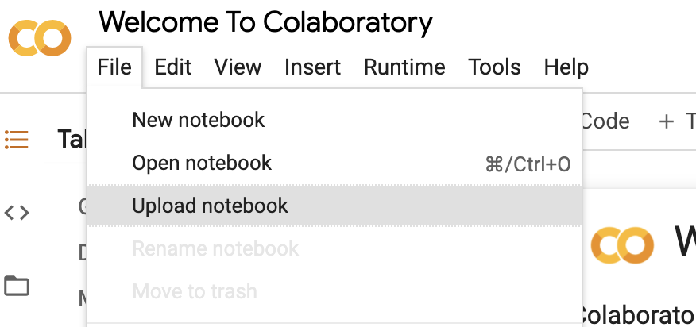

# CS598-DL4H-Project
Course project on CS598 - Deep Learning for Healthcare  
Selected research paper: [TransfromEHR](https://www.nature.com/articles/s41467-023-43715-z), [Github](https://github.com/whaleloops/TransformEHR)   
[Final Public Google Collab Link](https://colab.research.google.com/drive/1tVXk4Zf_dxCQ6hm8SeSmYRtUY1DmcVT1)    
Video [link](https://mediaspace.illinois.edu/media/t/1_uw253fz6)  
Group 91: Abilash Bodapati, Sneha Sarpotdar, Sotheara Chea


## Google Collab setup
* Download iPython notebook. *[instruction](https://colab.research.google.com/github/quantumlib/Cirq/blob/master/docs/tutorials/google/colab.ipynb#scrollTo=6q5lpwgW5TrE)* 
* Upload notebook to Google Colab. *[instruction](https://colab.research.google.com/github/quantumlib/Cirq/blob/master/docs/tutorials/google/colab.ipynb#scrollTo=czt1fSEHooF9)*  



##  Environment
#### Operating systems:
* Ubuntu 20.04.5 LTS
* GPU T4
* Google colab environment
* Python 3.8.11 with libraries:
* NumPy (currently tested on version 1.20.3)
* PyTorch (currently tested on version 1.9.0+cu111)
* Transformers (currently tested on version 4.16.2)
* tqdm==4.62.2
* scikit-learn==0.24.2

 ## Model
Here is the Github link for the [Paper's Model code](https://github.com/whaleloops/TransformEHR/blob/main/icdmodelbart.py).  The code was not reproducible due to missing Datacollator. Model Architecture:   Considering the code limitations, we decided to change the plan and implement below models from [Hugging face](https://huggingface.co/docs/hub/en/transformers) to train MIMICIV subset data with ICD codes and Visit date tokenization :
* BERT (Bidirectional Encoder Representations from Transformers)
* BART (Bidirectional Encoder and left-to-right Decoder from Transformers)   

## Data Setup
#### To get the Dataset mounted on Google Drive:  

*  Go to [MIMIC IV Website](https://physionet.org/content/mimiciv/2.2)
*  Download the dataset to your google drive
*  Validate the dataset is present under -> `MyDrive/mimiciv/2.2/hosp`  
    Example:
    *   `/content/drive/MyDrive/mimiciv/2.2/hosp/admissions.csv.gz`
    *   `/content/drive/MyDrive/mimiciv/2.2/hosp/diagnoses_icd.csv.gz`

#### Mount Notebook to Google Drive
```
from google.colab import drive
drive.mount('/content/drive', force_remount=True)
````


## Imports Modules
```sh
!pip install --upgrade accelerate
!pip install --upgrade transformers
!pip install --upgrade tqdm
!pip install --upgrade scikit-learn
!pip install --upgrade datasets
```


## References
1.  Citation to Original Paper: Yang, Z., Mitra, A., Liu, W. et al. TransformEHR: transformer-based encoder-decoder generative model to enhance prediction of disease outcomes using electronic health records. Nat Commun 14, 7857 (2023). https://doi.org/10.1038/s41467-023-43715-z. 2023 Nov 29;14(1):7857. doi: 10.1038/s41467-023-43715-z. PMID: 38030638; PMCID: PMC10687211.
2.  https://www.nature.com/articles/s41467-023-43715-z
3.  https://physionet.org/content/mimiciv/2.2/icu/#files-panel
4.  https://github.com/whaleloops/TransformEHR
5.  https://huggingface.co/docs/hub/en/transformers
